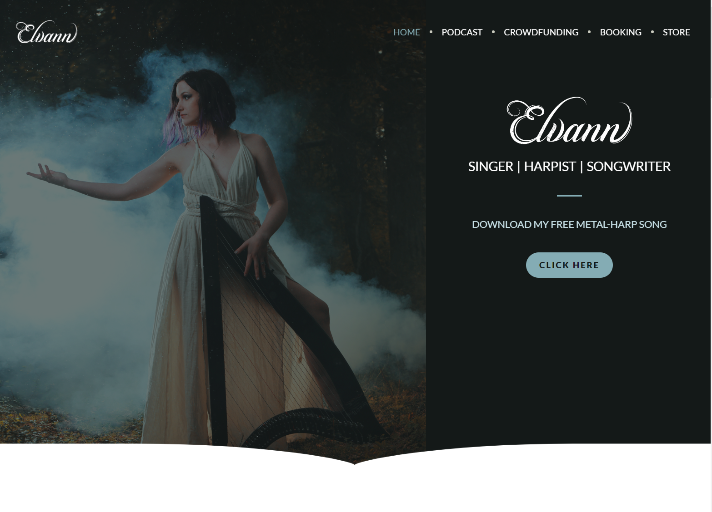
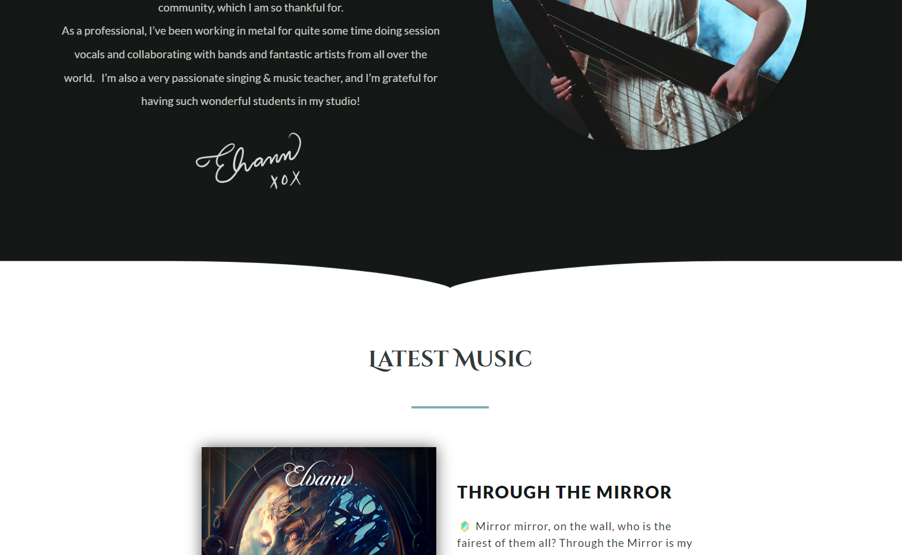

## Introduction

In the spirit of moving my music artist website platform away from using wordpress, I've been playing around different ways to implement my favorite visual features from ym landing page: a rounded divider as such:

Here's what it looks like lower on the page:

Looks like a simple enough challenge, but I added an extra layer of challenge: trying to come up with an elegant solution that would allow two sections side-by-side to support having background images, while staying responsive and using pure CSS.

## Challenge

Here were the terms of this challenge:

- The solution must use only Pure CSS
- The solution must be responsive
- Must work with a wide variety of different images and sizes
- Must support 2 consecutive sections with a background image.

## Solutions

Here are a couple iterations of the problem and solutions I came up with on [Codepen](http://codepen.io)

Here's my solution on codepend, which uses a custom path: https://codepen.io/elvann/pen/gOBrRWx

If you want to try it yourself you can use this project as a starting point: https://codepen.io/elvann/pen/WNaQKNa