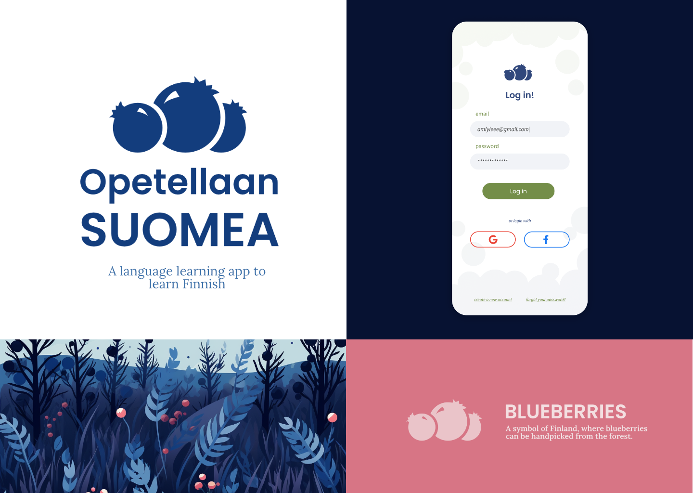
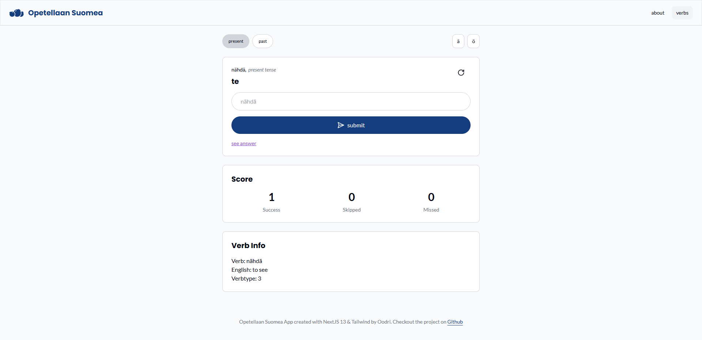
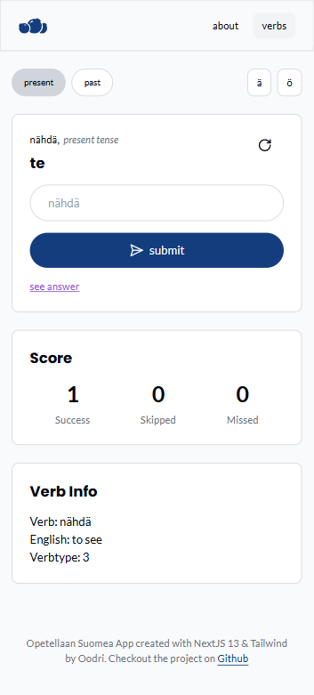

## About this Project

**Opetellaan Suomea** is a language learning app to help Finnish learners with declinaisons & conjugaisons.

When I started to learn Finnish and moved to Finland, I initially found the language very difficult.  In order to help me study, I created a simple app with one goal: practicing Finnish verb conjugaisons. I've now decided to rewrite this app with more modern technologies (**NextJS 13**, **Tailwind**, etc.)

## Goals

1. Create a simple to use web application that allows users to practice finnish verb conjugations on the go, without a need to login.

2. Develop a minimalist but approachable and fun brand identity through logo, colors and fonts.

## Brand Identity

Here's a brand board tho show the general colors and feel of the brand:

The blueberries are a representation of Finland's nature.  The brand features rich blue, green and red colors through flat-styled illustrations.  The logo and colors are meant to represent Finnish nature.  The brand icon uses blueberries as a symbol for Finnish nature and food culture, trying back down to what the service is about: teaching Finnish language.

We decided to opt for Poppins as the main logo and headers font because of it's fun, rounded and approachable look, while remaining minimalistic and modern.

## Web Application

[Try the application on the live site.](https://opetellaan-suomea.vercel.app/)

### Features

The web application features one set of exercises to practice verb conjugations both in the present and in the past tense.  The site displays a scoreboard to keep track of the user's results, and can be reset.  Each exercises also displays a verb info section that allows the users to learn conjugations through exercises.  The exercise segment also features a convenient way to add finnish characters for users who do not use the finnish keyboard.

### Desktop

### Mobile

