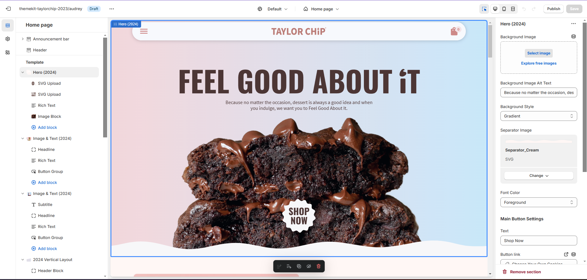
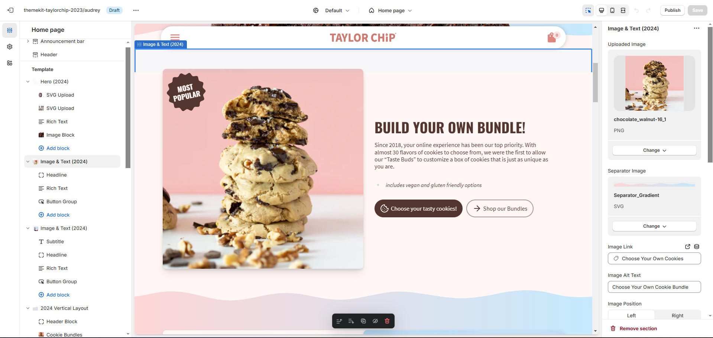

## Project Summary

Taylor Chip is a US-based company who sells cookies both through their physical store and online store.  I was hired as a web designer and developer and tasked with redesigning their landing page in order to help them look more professional, improve brand recognition and consistency, and help them increase their sales.

The secondary goal of the project was to build the new page in a way to utilize Shopify theme features that allow the users to create their own sections and hence allowing the users to modify and change the content of the pages themselves.  The sections had to be reusable and work both on mobile and desktop.

## Final Landing Page Redesign

Here's the final full-page desktop design of the landing page:

### Full-Length Screenshots

Click on the pictures to see them bigger

   

        
Landing Page Desktop (BEFORE):

        
    

  

     
Landing Page Desktop (AFTER):

        
    

    

    
Landing Page Mobile (AFTER):

        
    

## Case Study Walk-Through

Here's a video walk-through in which I show not only the updated page, but also show the "before" version of the page, describe some of the problems we needed to solve, and also a short overview of what the project looks like on the backend.

[Watch the Case Study Walk-Through Video](https://www.dropbox.com/scl/fi/umj64kg77fdxjqyrs6cov/Case-Study-Walk-Through.mkv?rlkey=doywze7ocu5tdwax9zzu7c3zg&dl=0)

The video showcases how the project wasn't just a simple landing page redesign, but also a complete re-architecturing from static html to fully reusable and customized section.  This update not only provided the client with a consistent styling for they new landing page, but also allows them to create new pages and sections by themselves with sections that are beautiful, on brand, and responsive.  This update will allow the, to significantly speed up the update process for them and the whole team.

> Here's some screenshots of the backend of Shopify, showcasing resuable sections and blocks the team can now customize without needing to access code

## Taylor Chip's Socials

- [LinkedIn](https://www.linkedin.com/company/taylorchip/posts/?feedView=all)
- [TikTok](https://www.tiktok.com/@taylorchip?is_copy_url=1&is_from_webapp=v1)
- [Instagram](https://www.instagram.com/taylorchip/)
- [Webstore](http://www.taylorchip.com)
